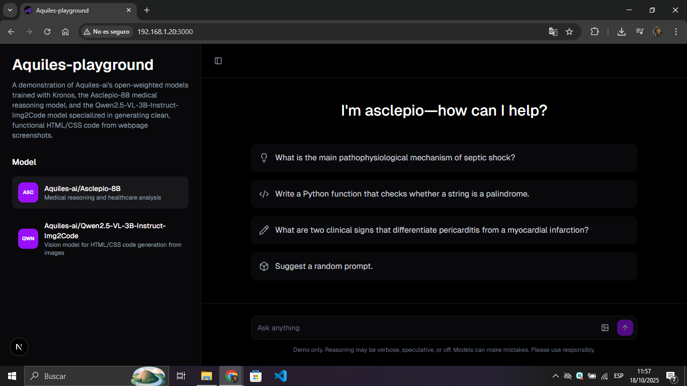

<h1 align="center">Aquiles-playground</h1>


<p align="center">
  <strong>Test our models locally from an easy-to-use chat interface</strong><br/>
  🚀 Next.js • vLLM • Async • OpenAI Client
</p>

## Prerequisites

Before running Aquiles-playground, ensure you have:
- Python 3.12+
- Node.js 18+
- CUDA-compatible GPU with at least 24GB VRAM
- CUDA 12.8 or compatible version

## Installation

### 1. Clone the repository and install dependencies
```bash
git clone https://github.com/Aquiles-ai/aquiles-playground.git
cd aquiles-playground
npm install
```

### 2. Install Python dependencies for vLLM

Install core libraries:
```bash
uv pip install torch==2.8 numpy packaging torchvision
```
```bash
uv pip install transformers ftfy kernels deepspeed vllm
```

**For Qwen2.5-VL-3B-Instruct-Img2Code model** (additional dependency):
```bash
uv pip install qwen-vl-utils
```

### 3. (Optional) Install Flash Attention for PyTorch 2.8+

For improved performance:
```bash
wget https://github.com/mjun0812/flash-attention-prebuild-wheels/releases/download/v0.3.14/flash_attn-2.8.2+cu128torch2.8-cp312-cp312-linux_x86_64.whl

pip install flash_attn-2.8.2+cu128torch2.8-cp312-cp312-linux_x86_64.whl
```

## Running the Models

> ⚠️ **Important**: vLLM can only serve one model at a time per instance. To switch models, you must stop the current server and start a new one.

### Option 1: [Asclepio-8B](https://huggingface.co/Aquiles-ai/Asclepio-8B)

Specialized model for medical reasoning and clinical decision-making:
```bash
vllm serve Aquiles-ai/Asclepio-8B \
  --host 0.0.0.0 \
  --port 8000 \
  --api-key dummyapikey \
  --max-model-len=16384 \
  --async-scheduling \
  --gpu-memory-utilization=0.90
```

### Option 2: [Qwen2.5-VL-3B-Instruct-Img2Code](https://huggingface.co/Aquiles-ai/Qwen2.5-VL-3B-Instruct-Img2Code)

Specialized model for generating clean and functional HTML/CSS code from screenshots of web pages:
```bash
vllm serve Aquiles-ai/Qwen2.5-VL-3B-Instruct-Img2Code \
  --host 0.0.0.0 \
  --port 8000 \
  --api-key dummyapikey \
  --mm-encoder-tp-mode data \
  --limit-mm-per-prompt '{"image":2,"video":0}' \
  --max-model-len=16384 \
  --gpu-memory-utilization=0.90
```

### The Athenea model family

To run this family of models, you first need to create a chat template to avoid inference errors with the reasoning tags. Create a file named `chat_template.jinja` with the following content:

```jinja

{{'<|im_start|>' + message['role'] + '\n' + message['content'] + '<|im_end|>' + '\n'}}


{{ '<|im_start|>assistant\n' }}

```

#### Option 1: [Athenea-4B-Coding](https://huggingface.co/Aquiles-ai/Athenea-4B-Coding)

Model specialized in solving code problems.

```bash
vllm serve Aquiles-ai/Athenea-4B-Coding \
  --host 0.0.0.0 \
  --port 8000 \
  --api-key dummyapikey \
  --max-model-len=16384 \
  --async-scheduling \
  --gpu-memory-utilization=0.90 \
  --chat-template chat_template.jinja
```

#### Option 2: [Athenea-4B-Math](https://huggingface.co/Aquiles-ai/Athenea-4B-Math)

Model specialized in mathematical reasoning

```bash
vllm serve Aquiles-ai/Athenea-4B-Math \
  --host 0.0.0.0 \
  --port 8000 \
  --api-key dummyapikey \
  --max-model-len=16384 \
  --async-scheduling \
  --gpu-memory-utilization=0.90 \
  --chat-template chat_template.jinja
```

#### Option 3: [Athenea-4B-Thinking](https://huggingface.co/Aquiles-ai/Athenea-4B-Thinking)

Conversational model

```bash
vllm serve Aquiles-ai/Athenea-4B-Thinking \
  --host 0.0.0.0 \
  --port 8000 \
  --api-key dummyapikey \
  --max-model-len=16384 \
  --async-scheduling \
  --gpu-memory-utilization=0.90 \
  --chat-template chat_template.jinja
```

## Configure Environment Variables

Create a `.env.local` file in the `aquiles-playground` folder:
```env
OPENAI_API_KEY="dummyapikey"
OPENAI_BASE_URL="http://127.0.0.1:8000/v1"
```

> **Note**: If running models on Lightning.ai with "Port Viewer", update `OPENAI_BASE_URL` to your forwarded URL (e.g., `https://8000-your-url.cloudspaces.litng.ai/v1`)

## Launch Aquiles-Playground

Start the development server:
```bash
npm run dev -- -H 0.0.0.0
```

Open your browser and navigate to `http://localhost:3000`

**You should see:**



## Switching Models

To switch between models:

1. Stop the current vLLM server (press `Ctrl+C` in the terminal running vLLM)
2. Start the desired model using the appropriate command from the "Running the Models" section
3. Refresh your browser at `http://localhost:3000`

## Troubleshooting

**Out of Memory Error:**
- Reduce `--gpu-memory-utilization` value (e.g., try 0.80 or 0.70)
- Reduce `--max-model-len` value

**Connection Error:**
- Verify vLLM server is running and listening on port 8000
- Check that `.env.local` has the correct `OPENAI_BASE_URL`

**Port Already in Use:**
- Change the port in both the vLLM command (`--port`) and `.env.local` file

## 📚 Learn More

### Fine-tuning Deep Dive: Medical Reasoning & Screenshot-to-Code

Explore the complete journey of training Asclepio-8B and Qwen2.5-VL-3B-Instruct-Img2Code from scratch:

🔗 **[Read the full article](https://fredy-rivera-dev-portafolio.vercel.app/blog/llm-finetuning)**

**What you'll learn:**
- LLM and Vision-Language Model architectures explained (with Manim animations)
- Fine-tuning techniques: Full Fine-tuning, LoRA, and QLoRA
- Introduction to Kronos - our fine-tuning framework
- Step-by-step training process with code examples
- Training metrics and performance analysis (wandb logs)
- Memory usage and optimization on Lightning.ai

## 📄 License

This project **(Aquiles-playground)** is licensed under the Apache License 2.0 - see the [LICENSE](LICENSE) file for details.

## 🔗 Links

- **Models:** 
    - [Asclepio-8B](https://huggingface.co/Aquiles-ai/Asclepio-8B)
    - [Qwen2.5-VL-3B-Instruct-Img2Code](https://huggingface.co/Aquiles-ai/Qwen2.5-VL-3B-Instruct-Img2Code)
    - [Athenea models](https://huggingface.co/collections/Aquiles-ai/athenea)

- **Datasets:**
    - [Aquiles-ai/Medical-Reasoning](https://huggingface.co/datasets/Aquiles-ai/Medical-Reasoning)
    - [HuggingFaceM4/WebSight](https://huggingface.co/datasets/HuggingFaceM4/WebSight)

**Training Platform:**
- [Lightning.ai](https://lightning.ai) - GPU cloud platform used for model training

<p align="center">
  Made with ❤️ by <a href="https://github.com/Aquiles-ai">Aquiles-ai</a>
</p>